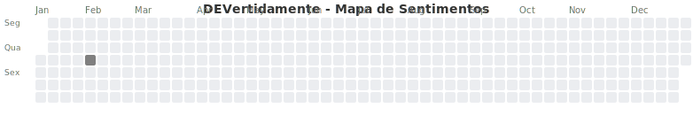

# 🎭 DEVertidamente

> Inspirado no filme **Divertidamente (Inside Out)**, este projeto registra meu sentimento predominante a cada dia.

## 📅 Mapa de Sentimentos




## 🎨 Legenda de Sentimentos
- 😊 **Alegria** `#F7D917`- 😢 **Tristeza** `#5B9BD5`- 😠 **Raiva** `#C00000`- 🤢 **Nojo** `#70AD47`- 😨 **Medo** `#7030A0`- 😰 **Ansiedade** `#FFA500`- 😳 **Vergonha** `#FF69B4`- 😑 **Tedio** `#808080`- 🥺 **Nostalgia** `#D2691E`- 😒 **Inveja** `#00CED1`

Nenhum registro ainda.

---

## 🚀 Como usar

1. **Registrar sentimento do dia:**
   ```bash
   python registrar.py
   ```

2. **Atualizar o gráfico:**
   ```bash
   python gerar_grafico.py
   ```

3. **Fazer commit:**
   ```bash
   git add .
   git commit -m "Sentimento do dia: [EMOJI] [SENTIMENTO]"
   git push
   ```

## 💡 Sobre o projeto

Este projeto é uma forma de acompanhar minha saúde emocional ao longo do tempo, identificando padrões e tendências nos meus sentimentos predominantes.

Última atualização: 29/01/2026
